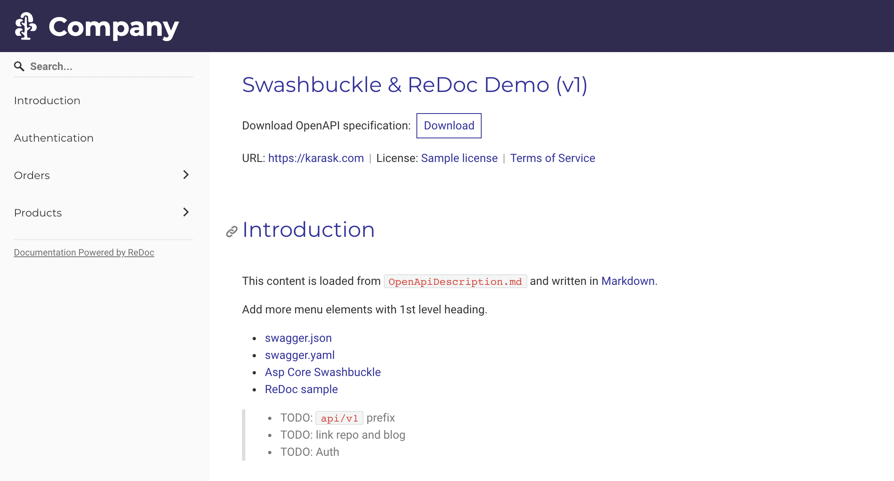

# Swashbuckle & ReDoc Demo

A dummy API to showcase advanced `Swashbuckle`/`Openapi`
and `ReDoc` setup.

Run locally and open `http://localhost:5000/api/docs`

### Todo

- [ ] Global `/api/v1/` prefix
- [ ] Add Auth annotations
- [ ] Configurable exceptions
- [ ] Slimmer problem responses
